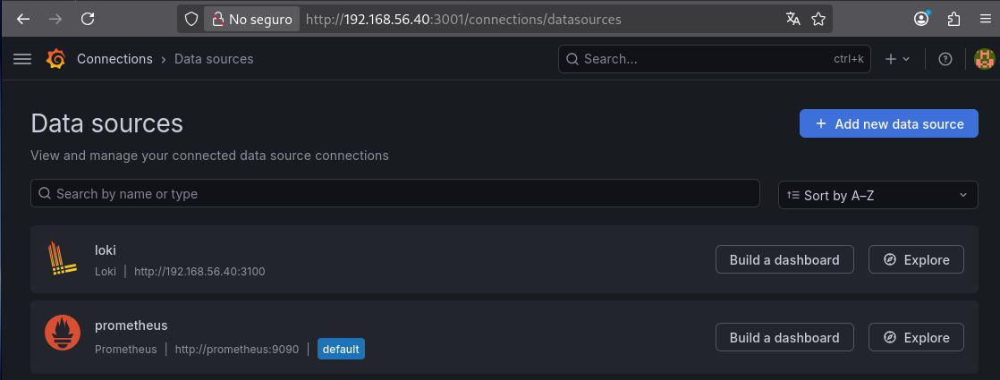

# Logging Basic

Mini DevOps Junior project focused on centralized logging using Loki, Promtail, and Grafana.

---

# Objective

Learn the basic concepts of centralized logging and modern observability using tools commonly used in real DevOps environments.

The stack allows:
- collecting Docker logs
- centralizing logs
- querying logs from Grafana
- troubleshooting issues

---

# Technologies

- Docker
- Docker Compose
- Loki
- Promtail
- Grafana
- Linux

---

# Architecture

```text
Docker Containers
        |
        v
Promtail
        |
        v
Loki
        |
        v
Grafana Explore
```

---

# Structure

```text
logging-basic/
├── docker-compose.yml
├── loki/
│   └── loki-config.yml
├── promtail/
│   └── promtail-config.yml
├── screenshots/
└── README.md
```

---

# Deployed Services

| Service | Port | Function |
|---|---|---|
| Loki | 3100 | Log storage |
| Promtail | 9080 | Log collection |
| Grafana | 3001 | Visualization |

---

# Deployment

```bash
docker-compose up -d
```

---

# Verification

## View containers

```bash
docker ps
```

## View Loki logs

```bash
docker logs logging-loki
```

## View Promtail logs

```bash
docker logs logging-promtail
```

## Check Loki status

```bash
curl localhost:3100/ready
```

Expected result:

```text
ready
```

---

# Grafana Configuration

## Add Loki datasource

Type:

```text
Loki
```

URL:

```text
http://SERVER_IP:3100
```

---

# Query Used

```text
{job="docker"}
```

This query allows viewing centralized Docker container logs.

---

# Real Troubleshooting

During the project, an issue occurred where Grafana was not displaying logs.

## Problem

```text
No logs found
```

## Cause

Incorrect Promtail path:

```yaml
__path__: /var/log/docker-containers/*.log
```

## Solution

Correct the path:

```yaml
__path__: /var/log/docker-containers/*/*.log
```

and restart the stack.

---

# Real-World Use Case

This type of stack is commonly used in modern DevOps environments for:

- troubleshooting
- centralized logging
- debugging
- observability
- error analysis

---

# Screenshots

## Loki logs in Grafana


## Loki datasource



---

# Result

Centralized logging system successfully working using Loki and Promtail.

---

# Status

Project completed successfully.
